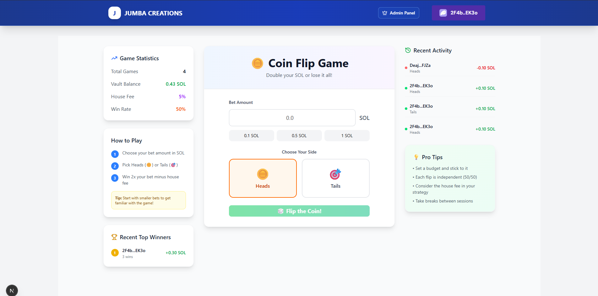

# 🪙 Solana Coin Flip Game

A decentralized coin flip betting game built on Solana blockchain using Anchor framework. Double your SOL or lose it all!



## 🎮 Game Overview

This is a simple yet engaging coin flip game where players can:
- Bet SOL on heads or tails
- Win 2x their bet amount (minus house fee)
- Experience instant results with on-chain randomness
- View game statistics and recent activity

## 🚀 Features

- **Decentralized Betting**: All bets are processed on-chain
- **Instant Payouts**: Winners receive payouts immediately
- **House Edge**: Configurable fee percentage for sustainability
- **Game Statistics**: Track total games, vault balance, and win rates
- **Recent Activity**: View recent wins and losses
- **Responsive UI**: Clean and intuitive interface

## 📊 Game Statistics

- **House Fee**: 5% (configurable)
- **Payout**: 2x bet amount (minus house fee)
- **Win Rate**: 50% (fair coin flip)

## 🛠 Technical Stack

### Backend (Smart Contract)
- **Framework**: Anchor Lang
- **Blockchain**: Solana
- **Language**: Rust
- **Network**: Devnet

### Program Features
- Initialize game state with configurable fee
- Deposit funds to vault (authority only)
- Place bets with choice validation
- Automatic settlement with randomness
- Withdraw funds (authority only)

### Frontend
- Modern web interface
- Real-time game statistics
- Bet amount selection (0.1, 0.5, 1 SOL)
- Heads/Tails selection
- Recent activity tracking

## 🔧 Smart Contract Details

### Program ID
```
CK9rjq6oyLK8uJBkzkg3CBPW4ydBdKM5khQQUigFuqng
```

### Core Functions

#### `initialize`
- Sets up the game state
- Configures fee percentage
- Sets authority for the game

#### `deposit`
- Allows authority to add funds to the vault
- Increases total available balance

#### `place_bet`
- Validates bet choice (0 = heads, 1 = tails)
- Transfers bet amount to vault
- Generates randomness using clock + user key
- Automatically settles bet and pays out winners

#### `withdraw`
- Allows authority to withdraw funds from vault
- Validates withdrawal amount against available balance

### Account Structures

#### `GameState`
```rust
pub struct GameState {
    pub authority: Pubkey,
    pub total_amount: u64,
    pub fee_percentage: u64,
    pub total_games: u64,
    pub bump: u8,
}
```

#### `BetAccount`
```rust
pub struct BetAccount {
    pub user: Pubkey,
    pub amount: u64,
    pub choice: u8, // 0 = heads, 1 = tails
    pub won: bool,
    pub settled: bool,
}
```

## 🌐 Deployment

The smart contract is deployed on **Solana Devnet**:
- **Network**: Devnet
- **Program ID**: `CK9rjq6oyLK8uJBkzkg3CBPW4ydBdKM5khQQUigFuqng`
- **Status**: Active

## 🎯 How to Play

1. **Connect Wallet**: Connect your Solana wallet to the dApp
2. **Set Bet Amount**: Choose your bet amount (0.1, 0.5, or 1 SOL, or enter custom amount)
3. **Choose Side**: Select either Heads (🪙) or Tails (🎯)
4. **Flip the Coin**: Click "Flip the Coin!" button
5. **Get Results**: Instantly see if you won or lost
6. **Collect Winnings**: Winners automatically receive 2x bet minus house fee


## 🔒 Security Features

- **Authority Checks**: Only authorized accounts can deposit/withdraw
- **Input Validation**: Bet choices and amounts are validated
- **Automatic Settlement**: No manual intervention required
- **Transparent Randomness**: Uses on-chain clock and user data

## 🚧 Future Improvements

### Enhanced Randomness
- **Switchboard VRF Integration**: Implement Switchboard's Verifiable Random Function for cryptographically secure randomness
- **Chainlink VRF**: Alternative oracle solution for provably fair randomness
- **Multiple Entropy Sources**: Combine multiple randomness sources for enhanced security


### Prerequisites
- Rust
- Solana CLI
- Anchor Framework
- Node.js (for frontend)

### Build and Deploy
```bash
# Build the program
anchor build

# Deploy to devnet
anchor deploy --provider.cluster devnet

# Run tests
anchor test
```

### Local Development
```bash
# Start local validator
solana-test-validator

# Deploy locally
anchor deploy --provider.cluster localnet
```

## 📝 License

This project is open source and available under the [MIT License](LICENSE).

## 🤝 Contributing

Contributions are welcome! Please feel free to submit a Pull Request.

## 📞 Support

For questions or issues, please open an issue on GitHub or contact the development team.

---

**⚠️ Disclaimer**: This is a gambling application. Please gamble responsibly and within your means. This project is for educational and entertainment purposes.